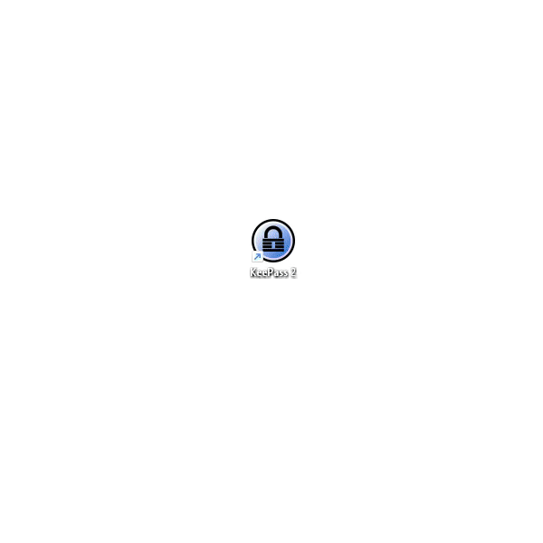

<h1 align="center">KeePass2Trezor</h1>

Less clicks, more security.

  
  
  

 

The **KeePass2Trezor** plugin for [KeePass 2.x](https://keepass.info/) leverages [Trezor's](https://trezor.io/) security design to encrypt your password database. The decryption key can only be accessed by physically pressing the confirmation button on the Trezor device.

It supports Trezor One, Model T and Safe 3 on Windows and Linux.

## Features

- **Secure Encryption:** Your KeePass database is securely encrypted using your personal Trezor device.
- **Simple Unlock:** Unlock your password manager with a single click on your Trezor button.
- **Recovery Seed:** Use a recovery seed to regain access to your passwords.
- **Optional Master Password:** Can be used with or without a master password.

## How to Use

1. Download **KeePass2Trezor.dll** from the [latest release](https://github.com/vnau/keepass2trezor/releases).
2. Copy the DLL to the **Plugins** folder of your [KeePass 2.x](https://keepass.info/) installation.
3. Create a new database, selecting **Trezor Key Provider** in the **Key file/provider** field.
4. Follow the instructions, unlock your Trezor if necessary, and confirm decryption of the key by pressing the button on the device.

### Linux Users

While the plugin works on Linux, additional steps are required:

1. **Configure udev rules:**
   - Follow the [udev rules configuration guide](https://trezor.io/learn/a/udev-rules) to establish communication with Trezor devices.

2. **Install `mono-develop` package:**
   - Ensure that the `mono-develop` package is installed, as the plugin relies on netstandard2.0, which is included with it.

3. **Check `libusb-1.0` installation:**
   - Verify the installation of `libusb-1.0-0`. If **KeePass2Trezor** still hangs with the message _"Connect your Trezor device"_ even with libusb installed, consider either creating a symlink [according to this instruction](https://github.com/LibUsbDotNet/LibUsbDotNet?tab=readme-ov-file#linux-users) or install `libusb-1.0-dev` package to address the issue.

4. **Reconnect the device:**
   - After completing the configuration steps, disconnect and then reconnect your Trezor device to ensure the changes take effect.

## Requirements

- **KeePass 2.35** or newer
- **.NET Framework 4.6.2** or higher
- **libusb-1.0** for Linux

## Security Considerations

> [!WARNING]
> If your device is lost or broken, you will need to purchase a new [Trezor](https://trezor.io/) or build a [PiTrezor](https://www.pitrezor.com) and initialize it using the saved seed phrase to regain access to the KeePass database.

> [!WARNING]
> Exporting the database in any format except _kdbx_ will cause loss of the Key ID and make decryption impossible. This is because other formats do not support public custom data (unencrypted) where the Key ID is stored.

## Technical Details

**KeePass2Trezor** is a _key provider plugin_ for the KeePass 2.x password manager. It uses a similar approach to derive the master key as the [Trezor Password Manager](https://trezor.io/passwords/) described in the [SLIP-0016](https://github.com/satoshilabs/slips/blob/master/slip-0016.md) document.

## Contribution

🌱 Contributions are welcome! If you have any ideas, suggestions, or bug reports, please open an issue or submit a pull request.

## License

This project is licensed under the MIT License. See the [LICENSE](LICENSE) file for details.
