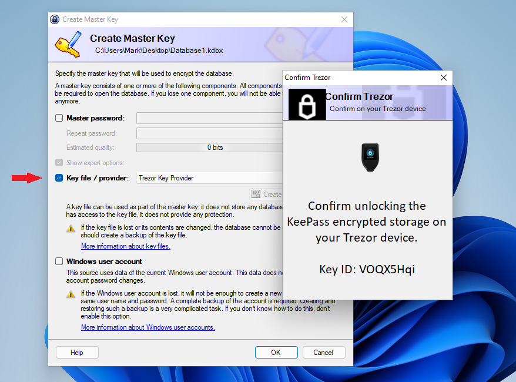

# 🔐 KeePass2Trezor

This plugin for [KeePass 2.x](https://keepass.info/) uses [Trezor's](https://trezor.io/) security design to encrypt the password database.
The decryption key can only be read from the Trezor by physically pressing the confirmation button on the Trezor device. 

> ⚠ KeePass2Trezor does not allow to restore the master key without the hardware wallet. If your device is lost or broken, then to regain access to KeePass database you will have to buy a new [Trezor](https://trezor.io/) or build up a [PiTrezor](https://www.pitrezor.com) and initialize it using the saved seed phrase.
> 
> ⚠ Exporting the database in any format except _kdbx_ will cause loss of the Key Id and therefore decryption of these containers will not be possible. This is because these containers do not support public custom data (unencrypted) where the Key ID is stored.
> 
> 🌱 Any feedback and contribution is much appreciated!

## Review

* KeePass database securely encrypted with your personal TREZOR device.
* A simple click on your Trezor button to unlock your password manager.
* Use a 24 words recovery seed to regain access to your passwords.
* Can be used with or without master password.

## How to use

* Copy __KeePass2Trezor.dll__ from the [latest release](https://github.com/vnau/keepass2trezor/releases) to the **Plugin** folder of the [KeePass 2.x](https://keepass.info/).
* Create a new database selecting __Trezor Key Provider__ in the __Key file/provider__ field.
* Follow instructions, unlock Trezor if necessary and confirm decryption of the key by clicking button on the device.

### Linux users

* Make sure that libusb-1.0 is installed.
* [Configure udev rules](https://trezor.io/learn/a/udev-rules) to communicate with Trezor devices.
* Disconnect and reconnect the device after configuration.

## Requirements

* _KeePass 2.35_ or newer
* _.NET Framework 4.6.2_ or higher
* _libusb-1.0_ for Linux

## Technical details

__KeePass2Trezor__ is a _key provider plugin_ for the KeePass 2.x password manager. It uses much the same approach to derive master key as [Trezor Password Manager](https://trezor.io/passwords/) described in the [SLIP-0016](https://github.com/satoshilabs/slips/blob/master/slip-0016.md) document.
